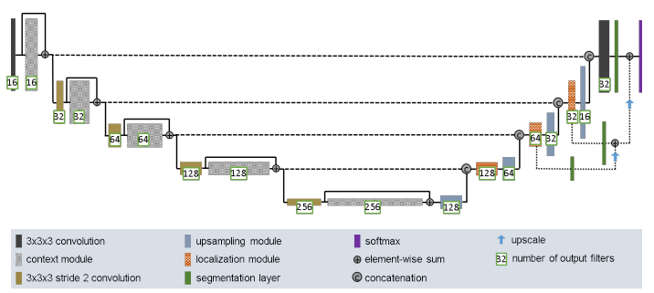

# Improved 2DUNet Segmentation of HipMRI data
## Author
Daniel Miller (s4742751)

## Task Overview
The task is to perform segmentation on the HipMRI data found here. The goal is to obtain an average dice score for the Prostate label of at least 0.75 on the test set.
The model architecture chosen is based on the Improved UNet architecture by Isensee et al. (2018). This model was chosen as a similar problem involving segmentation
on brain MRI scans was performed with this architecture, to a high degree of success (mean Dice score of 0.858)

## Data
The data consists of 2D MRI image slices of the male Pelvis collected as part of a radiation therapy study from the Calvary Mater Newcastle Hosptial. 
The data is sorted into images and their corresponding segmentation masks. Images are in greyscale, with pixel intensities ranging from 0 to 255. The
Segmentation masks contain 6 classes, represented as integers from 0 to 5. The integer mappings are:

## Classes
**0** = Background 
**1** = Body
**2** = Bones
**3** = Bladder
**4** = Rectum
**5** = Prostate

We have below an example image from the dataset along with its corresponding segmentation mask:

## Data Preprocessing
**Normalisation**: MRI intensity values are non-standardised across different machines, therefore it is critical to normalise the pixel intensities. This also has the added
benefit of improving model stability for our neural network.
**Augmentation**: Random vertical flips and random rotations (+- 10 degrees) were applied to the data, with a probability of 0.5 for both.
**Resizing**: The images in the dataset vary in their dimensions. Some images are (256x128) and others are (256x144). The network requires that inputs have the same dimensions
therefore the (256x144) images were resized to be (256x128) using bilinear interpolation.
**data split**: The data comes pre-split into train, validation and test tests with their respective masks. The training set contains 11460 images, with the validation sets and test sets both containing 540 examples.
**order**: The training data is shuffled by the data loader to ensure that the network does not learn an order to the training data. This is crucial as consecutive slices in the data
represent 3D volumes for each patient measured. 

## Model Architecture
Below is an image on which the model was based:

## Components
Following the standard UNet structure, the model contains an Encoder path, Bottleneck, and decoder path.
Unlike a standard UNet, this improved UNet contains various extra components that make improvements for complex tasks such as MRI segmentation.

**Activation Function**: the model uses **Leaky ReLU** as the activation function, with a negative slope of 10^-2. 
**Context Modules**: the encoder contains 4 context modules, which each contain two 3x3 convolutional layers, with a dropout layer in between. Each 
Context module (block) has a residual connection.
**Bottleneck Layer**: The bottleneck layer of the network consists of one single context block, followed immediately by an upsampling block.
**Upsampling Modules**: Before each localisation block, the output of the previous block is passed through an upsampling module, which uses nearest-neighbour
interpolation to scale inputs by a factor of 2. This is followed by a single 3x3 convolution that halves the number of feature maps.
**Concatenation**: As is standard for the UNet architecture, the outputs of the encoder modules are concatenated to the inputs of the localisation blocks
at their corresponding level (i.e output of first context block is concatted with input of last localisation module).
**Localisation Modules**: The decoder path of the network uses localisation blocks, which each contain a 3x3 and 1x1 convolution, where the 1x1 convoluton
halves the number of feature maps in the output.
**Deep Supervision**: The model employs deep supervision in the decoder path, which involves using segmentation layers on the localisation blocks
leading up to the final convolution in the encoder path. The outputs of these segmentation layers are all element-wise summed prior to applying the softmax function.

